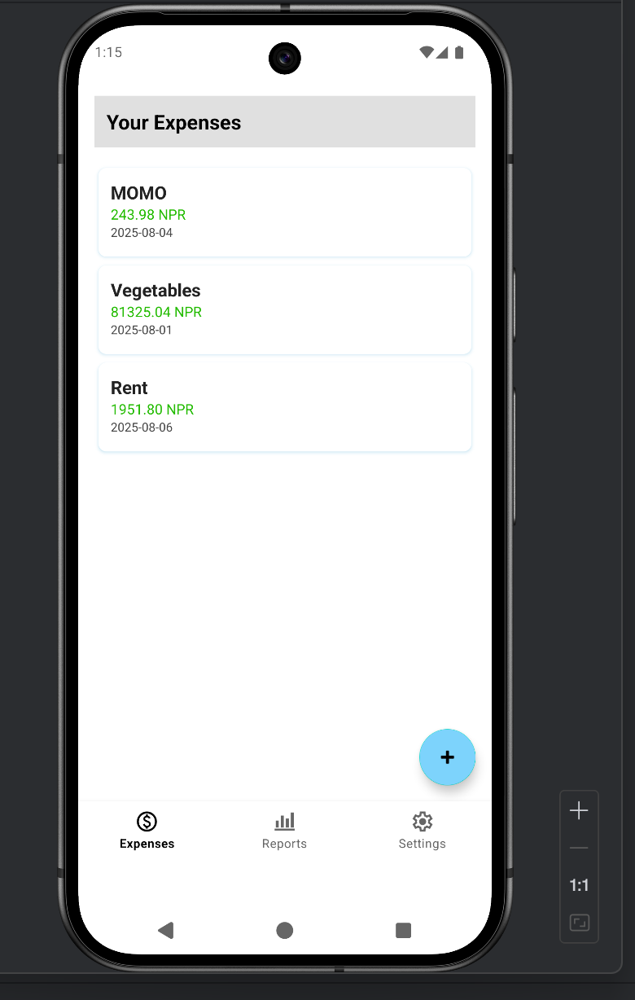
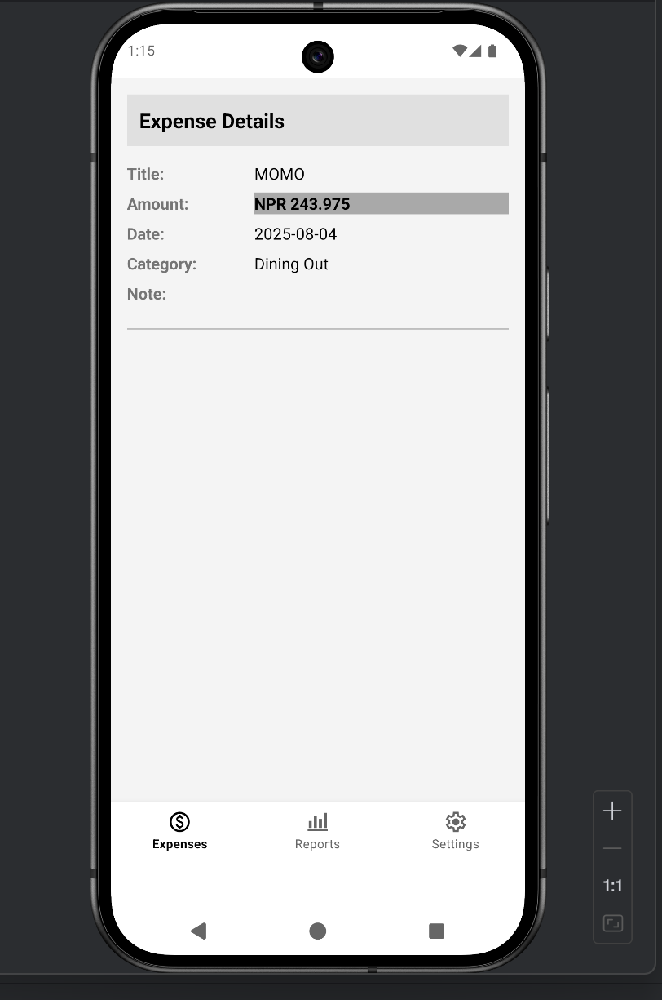
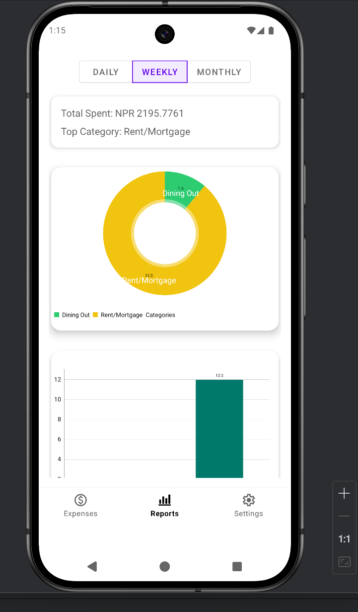
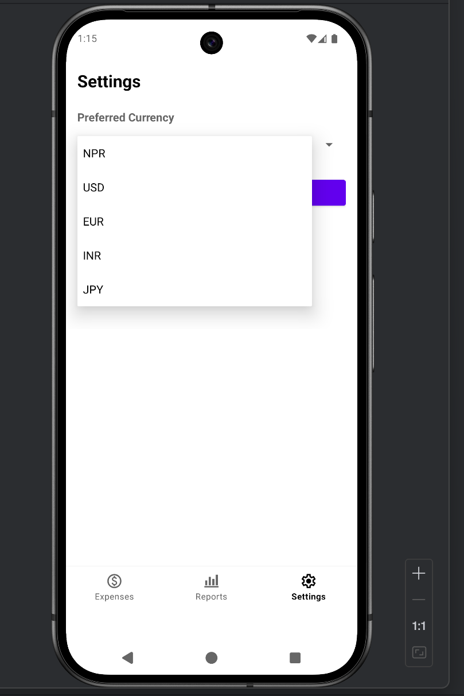
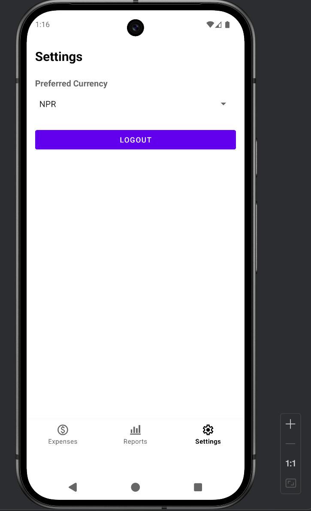
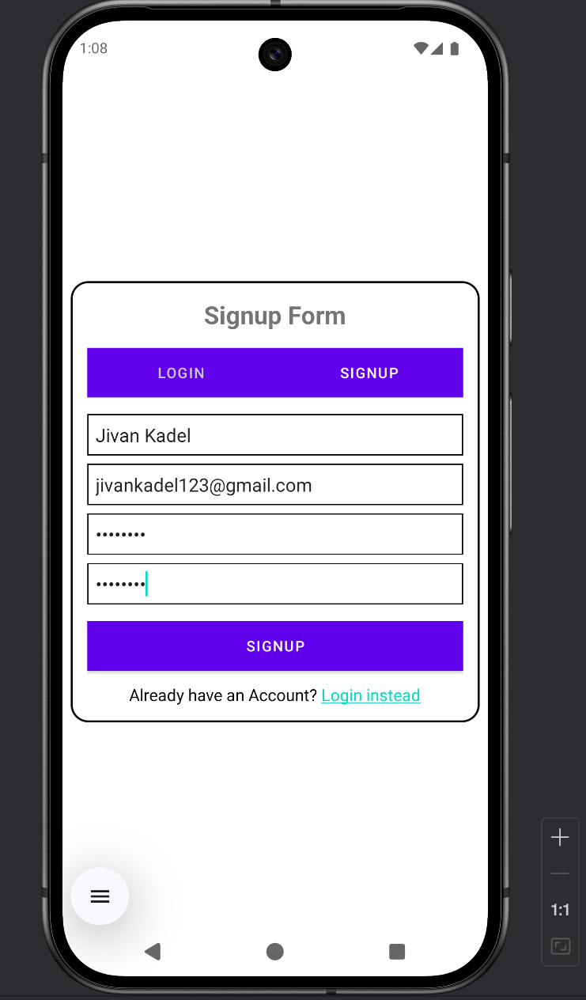

# Expense Tracker App

A simple and intuitive Android app to help users manage their daily expenses, track spending habits, and view summaries across different timeframes. Supports currency conversion using live exchange rates.

---

## Screenshots

| Home Screen                    | Expense Detail                     | Periodic Summary                      |
| ------------------------------ | ---------------------------------- | ------------------------------------- |
|  |  |  |

| Currency Change                              | Logout                     | Login / Signup                            |
| -------------------------------------------- | -------------------------- | ----------------------------------------- |
|  |  |  |

---

## Features

- **User Authentication**

  - Sign up and log in securely
  - Logout functionality

- **Expense Management**

  - Add new expenses with category and amount
  - View all expenses in a scrollable list
  - Delete unwanted entries
  - Tap to view detailed expense info

- **Currency Conversion**

  - Change preferred currency
  - Fetches daily exchange rates via [Free API](https://latest.currency-api.pages.dev/v1/currencies/eur.json)

- **Summaries**
  - Daily, weekly, and monthly expense summaries
  - Visual breakdowns for better insights

---

## 🗄️ Tech Stack

| Layer    | Technology                                                                              |
| -------- | --------------------------------------------------------------------------------------- |
| Language | Java                                                                                    |
| Database | SQLite                                                                                  |
| API      | Free Exchange Rate API (`https://latest.currency-api.pages.dev/v1/currencies/eur.json`) |
| IDE      | Android Studio                                                                          |

---

## 📦 Installation

1. Clone the repo:
   ```bash
   git clone https://github.com/yourusername/expense-tracker.git
   ```
